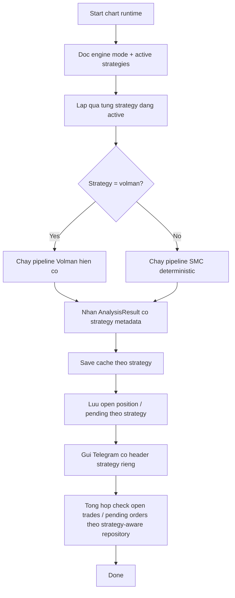

# Plan - Them he thong SMC chay song song voi he thong trading hien tai va gui Telegram

## Context

Repo hien tai da co 1 luong `charts` kha day du cho trading:

- `src/charts/index.ts` la orchestration chinh: load cache, analyze, luu open position/pending, gui Telegram, check open trades/pending orders
- `src/charts/deterministic-pipeline.ts` da co numeric engine cho Bob Volman setups
- `src/charts/analyzer.ts` + screenshot flow phuc vu AI vision mode
- `src/shared/telegram.ts` dang format thong diep va tieu de theo huong Bob Volman
- `src/charts/positions-repository.ts` hien tai chong trung theo `pair`, chua phan biet theo he thong/chien luoc

Nguoi dung muon bo sung **SMC (Smart Money Concepts)** cho he thong trading hien tai va cho phep:

1. He thong cu van chay
2. He thong SMC moi chay song song
3. SMC duoc phan tich bang thuat toan
4. Ket qua SMC duoc gui vao Telegram

## Nhan dinh kien truc

De tranh scope vo qua rong, SMC nen duoc lam theo huong **deterministic OHLC engine** truoc, khong phu thuoc AI vision.

Ly do:

- Repo da co `fetchOhlcHistory()` + cache + indicator/runtime phu hop cho engine so hoc
- SMC can tinh swing, BOS/CHOCH, liquidity sweep, order block, FVG tu gia du lieu nen se hop hon AI vision cho MVP
- Chay song song 2 he thong se on dinh hon neu ca hai deu tra ra `AnalysisResult` cung contract hien co

## Muc tieu

Them 1 strategy moi `smc` co the chay song song voi `volman`, trong do:

- SMC doc OHLC va tao signal theo market structure
- Runtime co the chon `volman`, `smc`, hoac `volman+smc`
- Telegram nhan biet ro thong diep thuoc he thong nao
- Open positions / pending orders / performance tracking khong con xung dot khi 2 he thong cung danh cung 1 pair

## SMC MVP de xuat

MVP khong nen om toan bo SMC nang cao. De xuat pham vi dau tien:

- Xac dinh swing highs / swing lows
- Xac dinh BOS / CHOCH tren H4 de lay directional bias
- Phat hien liquidity sweep gan swing muc tieu
- Xac dinh displacement + order block
- Xac dinh FVG gan nhat va premium/discount zone
- Tim entry M15 cung huong voi bias H4
- Xuat setup LONG/SHORT voi entry, stop loss, TP1, TP2, confidence, reasons, risks

Khong nen dua vao MVP dot nay:

- Mitigation block phuc tap nhieu cap
- Session model nang cao
- SMT divergence
- Multi-symbol correlation
- Tu dong vao lenh broker

## Van de can giai quyet truoc khi code

1. **Song song 2 he thong**
   - `shadow` hien tai chi la so sanh engine AI vs deterministic, khong phai chay song song 2 strategy user-facing
   - Can 1 concept moi cho strategy/runtime, tach khoi `CHART_ENGINE_MODE`

2. **Storage xung dot**
   - `saveOpenPosition()` va `savePendingOrder()` dang dedupe theo `pair`
   - Neu Volman va SMC cung co lenh EURUSD thi he thong thu 2 se bi chan sai
   - Can them `strategy_key` hoac field tuong duong vao DB + repository + performance reporting

3. **Telegram format**
   - Tieu de, heartbeat, setup text dang hardcode "Bob Volman"
   - Can generalize de gui duoc message cho `Volman`, `SMC`, hoac runtime song song

4. **Cache / idempotency**
   - Cache key phan tich can phan biet theo strategy, engine mode, timeframe mode
   - Tranh reuse cache Volman cho SMC hoac nguoc lai

## De xuat env/runtime moi

- `CHART_ACTIVE_STRATEGIES=volman,smc`
  - default de xuat: `volman`
- `SMC_HTF_TIMEFRAME=H4`
- `SMC_LTF_TIMEFRAME=M15`
- `SMC_SWING_LOOKBACK=3`
- `SMC_MIN_DISPLACEMENT_ATR=1.2`
- `SMC_MIN_CONFIDENCE=70`

Ghi chu:

- Khong nen dung H1 cho MVP vi `ChartTimeframe` hien tai moi co `D1 | H4 | M15`
- Neu can mo rong timeframe sau nay thi tach task rieng

## So do runtime de xuat



## Subtasks

| ID | Subtask | Muc tieu |
| --- | --- | --- |
| 01 | `01-design-smc-runtime-contract/` | Chot contract strategy runtime, SMC MVP rules, va boundary giua Volman / SMC / engine mode |
| 02 | `02-add-strategy-aware-storage/` | Them strategy-aware data model cho positions, pending orders, cache, va performance tracking |
| 03 | `03-build-smc-detection-engine/` | Implement SMC deterministic pipeline tu OHLC: swing, BOS/CHOCH, liquidity sweep, OB/FVG, signal assembly |
| 04 | `04-wire-parallel-telegram-delivery/` | Noi runtime song song, cache, Telegram, va orchestration de gui thong bao SMC/Volman ro rang |
| 05 | `05-add-tests-backtest-and-docs/` | Them unit/integration tests, fixture cho SMC, cap nhat `.env.example` va tai lieu van hanh |

## Verification chung

```bash
npm run test -- --run
npm run build
```

Verification runtime de xuat sau khi xong:

```bash
$env:CHART_ENGINE_MODE='deterministic'
$env:CHART_ACTIVE_STRATEGIES='volman,smc'
npm run analyze
```

Ky vong:

- Runtime chay duoc ca Volman va SMC trong cung mot lan run
- Telegram phan biet ro thong diep strategy nao
- 2 strategy co the cung luu signal cung `pair` ma khong bi dedupe sai
- Cache, pending orders, open positions, va reporting khong bi tron lan giua 2 he thong
