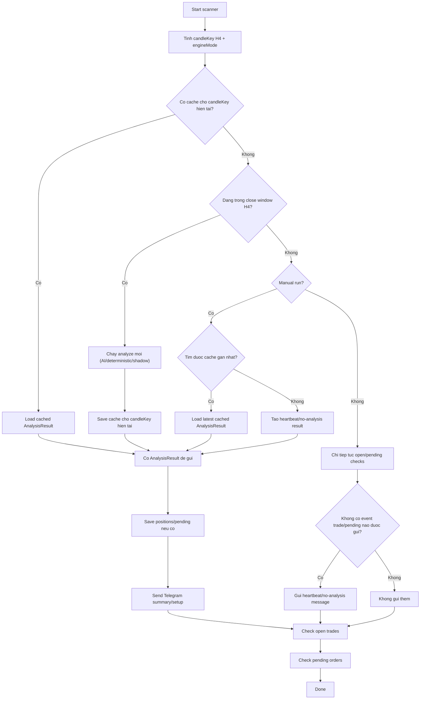

# Plan - Gui heartbeat/phan tich chart khi chay tay hoac ngoai cua so dong nen

## Context

Flow hien tai trong `src/charts/index.ts` chi gui Telegram khi co `result` phan tich.

- Neu co cache cho `candleKey` hien tai -> load cache -> van gui Telegram.
- Neu dang trong `CANDLE_CLOSE_WINDOW_MS` sau luc nen H4 dong -> tao phan tich moi -> gui Telegram.
- Neu **ngoai cua so dong nen** va **khong co cache cho candleKey hien tai** -> bo qua capture/analyze, chi check open trades + pending orders, **khong gui gi**.

Dieu nay gay ra 2 van de van hanh:

1. Khi chay lenh bang tay (`npm run analyze`) ngoai cua so dong nen, user khong nhan duoc bat ky tin nhan nao de biet job van chay tot.
2. Khi scheduler tu dong chay ngoai cua so dong nen va khong co lenh nao can dong / pending nao can xu ly, Telegram im lang hoan toan -> kho phan biet "khong co tin hieu" voi "job loi / job khong chay".

## Muc tieu

Dat 1 co che "heartbeat" / "analysis summary" de:

- Khi chay tay hoac scheduler chay ngoai cua so dong nen, he thong van gui 1 thong diep Telegram cho biet job dang hoat dong.
- Neu co du lieu phan tich chart cache hop le gan nhat thi gui summary/analysis do.
- Neu khong co setup, van gui thong diep "khong co setup" hoac "khong co phan tich moi, he thong van hoat dong".
- Van giu logic khong phan tich tren nen H4 dang hinh thanh.

## Pham vi mong muon

- Khong doi logic phat hien setup deterministic/AI.
- Khong doi luat cache OHLC.
- Co the them config env de bat/tat heartbeat cho auto-run va manual-run neu can.
- Can bo sung test va cap nhat `.env.example` neu them env moi.

## Quy tac mong muon

1. **Manual run**
   - Neu user chay tay (`npm run analyze` hoac `npm start` tu terminal) va ngoai cua so dong nen:
     - uu tien gui **phan tich cache gan nhat** neu co;
     - neu khong co cache hop le thi gui **heartbeat/no-analysis message**.

2. **Auto run**
   - Neu scheduler chay ngoai cua so dong nen:
     - van check open/pending nhu hien tai;
     - neu khong co event dong lenh / trigger order / thong bao khac da duoc gui, thi gui **heartbeat/no-analysis message** de xac nhan job van song.

3. **No-setup case**
   - Neu co `AnalysisResult` nhung khong co setup vuot threshold, van gui thong diep tong hop nhu hien tai.

## So do flow mong muon



## De xuat env/config lien quan

Env hien dang anh huong truc tiep den flow charts:

- `CHART_ENGINE_MODE`
- `CHART_SIGNAL_CONFIDENCE_THRESHOLD`
- `PENDING_ORDER_EXPIRY_RUNS`
- `AI_VISION_MODEL`
- `AI_VISION_MODEL_FALLBACKS`
- `OPENROUTER_API_KEY`
- `OPENROUTER_RATE_LIMIT_RPM`
- `OPENROUTER_TIMEOUT_MS`
- `METAAPI_TOKEN`
- `METAAPI_ACCOUNT_ID`
- `METAAPI_REGION`
- `METAAPI_MARKET_DATA_BASE_URL`
- `METAAPI_SYMBOL_SUFFIX`
- `TWELVEDATA_API_KEY`
- `TWELVEDATA_RATE_LIMIT_RPM`
- `SUPABASE_URL`
- `SUPABASE_KEY`
- `TELEGRAM_BOT_TOKEN`
- `TELEGRAM_CHAT_ID`
- `LOG_LEVEL`
- `LOG_PRETTY`

Env moi co the can them neu chon cho phep tuy bien heartbeat:

- `CHART_SEND_HEARTBEAT_OUTSIDE_CLOSE_WINDOW=true|false`
- `CHART_SEND_HEARTBEAT_ON_MANUAL_RUN=true|false`
- `CHART_HEARTBEAT_USE_LATEST_CACHE=true|false`

## Subtasks

| ID | Subtask | Muc tieu |
| --- | --- | --- |
| 01 | `01-design-offwindow-heartbeat-flow/` | Chot contract runtime: manual run, auto run, cached-result fallback, heartbeat message, va cach phat hien run context |
| 02 | `02-implement-telegram-heartbeat/` | Sua `src/charts/index.ts` + helper lien quan de gui cached analysis/heartbeat ngoai close window ma khong pha flow hien tai |
| 03 | `03-add-tests-and-env-docs/` | Them test regression cho flow moi, cap nhat `.env.example`, va tai lieu env/behavior |

## Verification chung

```bash
npm run test -- --run
npm run build
```

Neu co luong runtime de verify bang tay:

```bash
$env:CHART_ENGINE_MODE='deterministic'; npm run analyze
```

Ky vong:

- Trong close window: van gui ket qua phan tich nhu cu.
- Ngoai close window:
  - manual run: van gui cache gan nhat hoac heartbeat;
  - auto run: van gui heartbeat neu khong co event trade/pending nao khac.
