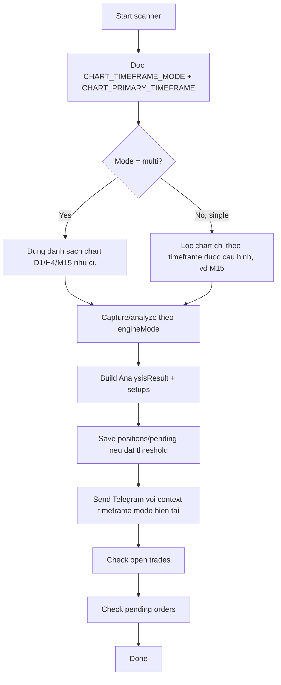

# Plan - Them config single-timeframe vs multi-timeframe, uu tien M15 cho production

## Context

He thong charts hien tai duoc thiet ke theo huong **multi-timeframe cung luc**:

- `src/charts/charts.config.ts` build san danh sach charts cho `D1`, `H4`, `M15`
- `src/charts/index.ts` capture/analyze theo bo `["D1", "H4", "M15"]`
- `src/charts/analyzer.ts` group screenshot theo pair va dua nhieu timeframe vao cung mot lan phan tich
- deterministic pipeline/runtime cung dang mang tinh multi-timeframe

Nguoi dung hien muon:

1. Tam thoi doi flow sang **phan tich theo tung khung thoi gian theo config**
2. Them bien cau hinh chon:
   - `multi-timeframe`
   - hoac `single-timeframe`
3. Timeframe production uu tien truoc mat la `M15`
4. Chay test/deploy nghiem thu production theo flow `single-timeframe + M15`

## Muc tieu

Them config runtime de scanner co the chay theo 2 che do:

- `multi`: giu nguyen behavior cu (D1/H4/M15 cung luc)
- `single`: chi chay 1 timeframe theo config, truoc mat la `M15`

## Pham vi mong muon

- Khong pha luong multi-timeframe hien tai
- Khong doi cache OHLC M15/H4 hien tai, ngoai tru khi can de phu hop flow moi
- Cac thong diep Telegram, setup metadata, capture, deterministic/AI path phai phan biet ro timeframe dang chay
- `.env.example` can duoc cap nhat

## De xuat env moi

- `CHART_TIMEFRAME_MODE=multi|single`
- `CHART_PRIMARY_TIMEFRAME=M15|H4|D1`

Default de xuat:

- `CHART_TIMEFRAME_MODE=multi` de giu backward compatibility
- `CHART_PRIMARY_TIMEFRAME=M15` de dung nhu production target khi bat `single`

## So do flow mong muon



## Cac diem can quyet

1. `CHARTS`
   - Giu nguyen export `CHARTS` cho backward compatibility hay them helper moi build chart list theo runtime config?

2. `analyzer.ts`
   - Trong `single-timeframe`, prompt/summary/setup co can ghi ro day la setup tu `M15` duy nhat khong?
   - `primaryTimeframe` cua setup trong `single` nen luon bang timeframe da config neu model/engine khong set?

3. `screenshot.ts`
   - `captureAllCharts()` hien dang chup toan bo `CHARTS`; can them helper capture theo danh sach chart runtime.

4. `index.ts`
   - Log runtime phai noi ro mode/timeframe dang chay
   - Cache analysis key can mang them timeframe mode/timeframe duoc chon de tranh reuse nham giua multi va single

## Subtasks

| ID | Subtask | Muc tieu |
| --- | --- | --- |
| 01 | `01-add-runtime-timeframe-config/` | Them env/config helper cho `multi|single` va primary timeframe |
| 02 | `02-wire-single-timeframe-runtime/` | Sua runtime charts/index/screenshot/analyzer de `single` mode thuc su chi chay theo timeframe config, uu tien `M15` |
| 03 | `03-add-tests-and-env-docs/` | Them test regression + cap nhat `.env.example` + ghi ro cach nghiem thu production voi `M15` |

## Verification chung

```bash
npm run test -- --run
npm run build
```

Verification thu cong production target:

```bash
$env:CHART_TIMEFRAME_MODE='single'
$env:CHART_PRIMARY_TIMEFRAME='M15'
$env:CHART_ENGINE_MODE='deterministic'
npm run analyze
```

Ky vong:

- Log cho thay mode `single`
- Chi chay chart `M15`
- Khong con capture/analyze `D1`/`H4` trong run single-timeframe
- Telegram/result phan anh ro la run theo `M15`
